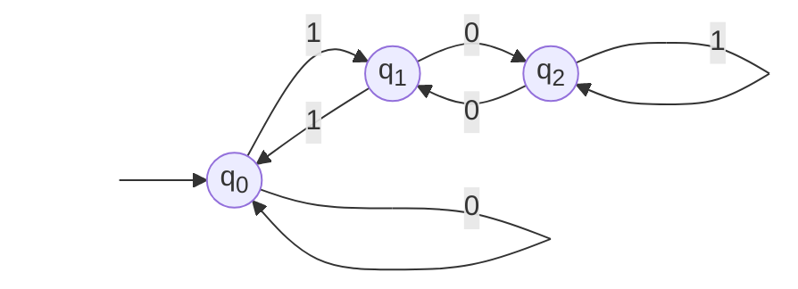
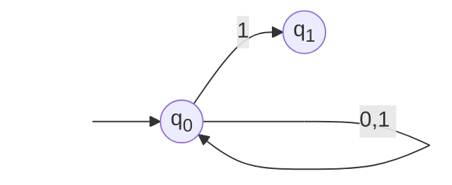
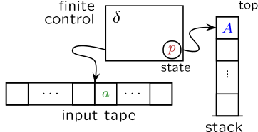
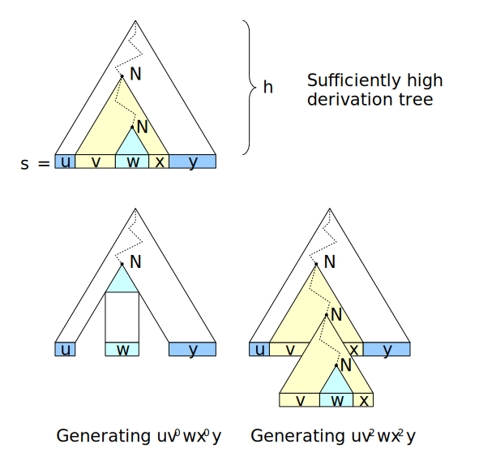

<div class="titlePage">

# CSE4083 Formal Languages
### Final Exam
##### Grant Butler | gbutler2020@my.fit.edu
</div>
<div class="center">

## Table of Contents
</div>

[TOC]

<div class="pageBreak"></div>

## Deterministic Finite Automata

### 1. Definition of a DFA

Give a precise (mathematical) definition of a DFA machine `M` and how its parts work together to solve problems.

###### Solution

Deterministic Finite Automata (DFA) are 5 tuple, consisting of a set of states _Q_, a set of symbols _Σ_, a transition function _δ_, a starting state _s_, and an end state _F_. It is commonly written as:

<div class="center">

$M = (Q, Σ, δ, s, F)$
</div>

DFA's are mathematical models and read a string of symbols over an input alphabet. They <ins>**always**</ins> either accept or reject the input string.

Typically written as a state diagram, the different parts of a DFA are states _Q_ are vertices, input characters which are written on arcs to show state transitions _δ_ between those states, the initial state _s_ maked with an arrow, and a final state _F_ marked with a double circle.

###### Example State Diagram of a DFA

<div class="center">


</div>

<div class="pageBreak"></div>

## Nondeterministic Finite Automata

### 2. Definition of an NFA

Give a precise (mathematical) definition of a NFA machine _M_ and outline how the NFA can be converted into a DFA.

###### NFA Definition

Similar to a DFA, an NFA is also a 5-tuple, (Q, Σ, δ, q<sub>0</sub>, F) as:
- Q: finite set of states
- Σ: finite set of input symbols
- δ: transition function
- q<sub>0</sub>: initial state
- F: final (accepting) state

###### Example State Diagram of an NFA

<div class="center">


</div>

<div class="pageBreak"></div>

###### Converting an NFA to a DFA

An NFA defined as:

<div class="center">

$A = (Q, Σ, δ, q_0, f)$
</div>

can be converted to DFA:

<div class="center">

$B = A' = (Q', Σ, δ, q_{0}', f')$
</div>

By perfoming the following tasks:
1. Replace states _Q_ with the power set of _Q_, _Q'_.
2. Set starting state of _B_ to _q<sub>0</sub>'_.
3. Define all words $σ_0, σ_1, ..., σ_n ∈ Σ*$ and all states _C ∈ Q'_ with transition function:
<div class="center">

$δ : (Q' \times Σ*) → Q'$
</div>

Essentially, the DFA _B_ is equivalent in states _C ∈ Q'_ if and only if the word for the NFA _A_ gives one of the states _s ∈ C ⊆ Q_. Final state _f'_ is described by every _C ∈ Q'_ having at least one final state _c ∈ f_. Therefore, the DFA _B_ accepts the same language and words as the NFA _A_, so the two are equivalent.


<div class="pageBreak"></div>

## Regular Expressions

### 3. Regular Expressions in Programming

Describe how regular expressions are use in programming. For example, to define numbers, identifiers, keywords, etc.

###### Solution

Regular expressions are often used in different programming languages. In Python, for instance, the `re` package can be imported and used to do specific tasks relating to data. For instance, from my CSE3231, I used regex like this:

```py
# now to parse the other link
link_regex = re.compile(r'HREF="(?:[^"]|"")*"')  # regex for the href
href_str = link_regex.search(main_html).group()  # getting the link
```

This allowed me to search for an `href` in an html file and find the link.

In the POSIX library, expressions like `[]`, `[:number:]`, `[:lower:]`, and `[:word:]` are used to find different types of characters. These can be used to help searching large amounts of data and filtering it for specific patterns.SS

<div class="pageBreak"></div>

## Closure Properties of Language Classes and Operations

### 4. List of Closed Classes

Some operations are closed for certain language classes. List classes that are closed with respect to (common formal language operations).

###### Solution

Closure properties on regular language are defined as operations on regular languages that are garunteed to produce a regular language. Closure means that the operation will result in a language that is the same type as what it operated on.

<ins>Closure properties of Regular Languages</ins>:
- Kleen Closure
- Positive Closure
- Complement
- Reverse Operator
- Complement
- Union
- Intersection
- Set Difference
- Homomorphism
- Inverse Homomorphism


<div class="pageBreak"></div>

## Decision Problems of Language Classes

### 5. Types of Questions

Some "yes/no" questions can be answered correctly by some algorithm. Other questions place constrains on parameters to filter the solutions and perhaps select a best answer depending on some criterion. Other questions have no known computable answer.


<div class="pageBreak"></div>

## Pushdown Automata and Context-Free Languages

### 6. Definition of a PDA

Give a precise (mathematical) definition of a PDA and how its parts work together to solve problems.

###### Solution

A pushdown automata (PDA) is described as a 7-tuple:

<div class="center">

$M = (Q, Σ, Γ, δ, q_0, Z, F)$ where
</div>

- $Q$: a finite set of states
- $Σ$: a finite set called _input alphabet_
- $Γ$: a finite set called _stack alphabet_
- $δ$: a finite subset of $Q \times(Σ\ ∪\ {ε})\times Γ\times Q \times Γ^*$, the _transition relation_
- $q_0 ∈ Q$: start state
- $Ζ ∈ Γ$: the _initial stack symbol_
- $F ⊆ Q$: the set of _accepting states_

###### Example of PDA

<div class="center">


</div>


<div class="pageBreak"></div>

## Production Rule for Context-Free Grammars

### 7. Ambiguity in Parsing

What is _ambiguity_ with respect to parsing a string _w_ for membership in a language _L_ generated by a context-free grammar _G_? Why does it master? Can it be mitigated?

###### Solution

In context free grammars, derivation is done by replacing non-terminal symbols with terminal symbols until all non terminal symbols are replaced by terminal ones. Thus, a context free grammar _G_ has:

_V_: finite set of terminal symbols
_T_: a finite set of non terminal symbols
_P_: a set of production rules
_S_: the start symbol

Ambiguity is when a grammar _G_ manages to have more than one leftmost derivation tree or more than one right hand derivation tree. Ambiguity matters because it causes confusion, and should be removed because each parsing tree will have some meaning, and if a grammar has more than one parsing tree, then the mentioned grammar has more than one meaning. Ambiguity then, will compromise the accuracy of the grammar.

Ambiguity can be removed/mitigated by using precedence rules, semantics, grouping rules, or by improving the grammar itself.


### 8. Chomsky Normal Form

Most useful grammars can be translated into a _normal form_ making answers to questions about the language more transparent.

###### Solution

A context free grammar is in Chomsky Normal Form if all production guidlines fulfill one of the following situations:

- a non-terminal generating a terminal
- a non-terminal generating two non-terminals
- begin image generating ε


<div class="pageBreak"></div>

## Pumping Lemmas

The Pumping lemma for regular languages is easy to visualize. (if a FSM for a regular language has fewer states than it’s input string length, then by the pigeonhole principle, there must be a loop in the machine that can pump a sub-string that can be pumped.)

### 9. How Pumping Lemma Works

How is this pumping lemma used (what is its proof technique)? Describe the structure of its pre-conditions, and give an example of it’s use.

The Pumping lemma for Context-Free languages is more difficult for me to visualize.

(if a PDA for a context-free language has accepts a sufficiently long string then there is an early sub-string and a later sub-string each of which may be pumped.)

If _w_ is a efficiently long string in a CFL then its parse tree can be pruned into 5 parts: A prefix tree, a sub-tree that can be repeated, a middle tree, another repeatable sub-tree, and a boundary tree.

###### Solution

There is pumping lemmas for ordinary languages and setting free languages. If a language _L_ is context free, then there exists some interger $p \leq 1$ called pumping length, such that every string _s_ in _L_ that has a length of _p_ or more symbols can be written as

<div class="center">

$s = uvwxy$
</div>

with substrings _u, v, w, x,_ and _y_ such that:

1. $|vx| \geq 1$
2. $|vwx| \leq p$
3. $uv^nwx^ny ∈ L$ for all $n \geq 0$

Pumping lemma for context free languages is a property all context free languages are garunteed to have. Pumping lemma states that a string _s_ can be split into five substrings, as described above, that can produce a string that is still in the language. The process of "pumping up" the copies of strings _v_ and _x_ is what gives it it's name.

###### Diagram

<div class="center">


</div>


### 10. Pumping Lemma In Use

How is this pumping lemma used (proof technique)? That is, describe the structure of its pre-condition, and give an example of it’s use.

###### Solution

Pumping lemma is used to prove that a language _L_ is non-context-free by showing that arbitrarily long strings _s_ are in _L_ that cannot be pumped without producing strings outside.

###### Example

A language $L = \left\{a^nb^nc^n|n > 0 \right\}$ can be proven non-context-free with pumping lemma. A string $s = a^pb^pc^p$ is in _L_. Using pumping lemma, we can write _s_ as $s = uvwxy$, and then we can use the descibed process to then find that substring _vwx_ can have no more than two distinct symbols. There are five possibilities:

1. $vwx = a^j$ for some $j <= p$
2. $vwx = a^jb^k$ for some $j$ and $k$ with $j + k <= p$
3. $vwx = b^j$ for some $j <= p$
4. $vwx = b^jc^k$ for some $j$ and $k$ with $j + k <= p$
5. $vwx = c^j$ for some $j <= p$

It is verifiable that $uv^iwx^iy$ does not contain equal numbers of each letter for any _i != 1_. Therefore, $uv^2wx^2y$ does not have the form $a^ib^ic^i$, so then the string is not in language _L_. This means that language _L_ is not context free.


### 11. Context-Free Grammars in Chomsky Normal Form

When is a Context Free Grammar in Chomsky Normal Form?

A context free grammar is in Chomsky Normal Form if all production guidlines fulfill one of the following situations:

- a non-terminal generating a terminal
- a non-terminal generating two non-terminals
- begin image generating ε


<div class="pageBreak"></div>

## Transition Functions and Relations

### 12. Definitions of Function and Relation

What are precise (mathematical) definitions of _function_ and _relation_?

###### Solution

A **relation** R from non-empty set $B$ is a subset of the cartesian product $A \times B$. The subset is derived by descrbing a relationship between the first and second elements in the ordered pairs in $A \times B$.

A relation F from a set A to a set B is a **function** if every element of set A has one and only one image in set B.

Functions are a subset of relations.

### 13. Differences Between Function and Relation

Why is the (major) difference between function and relation interesting as related to classifying machines as deterministic or non-deterministic?

###### Solution

A deterministic algorithm is one which an outcome is determined by a unique formula. Algorithms where the outcome is not specific is called a non-deterministic algorithm. A non-deterministic algorithm cannot be executed in polynomial-time, while a deterministic algorithm can be executed in polynomial time.

### 14. State Transition Diagrams

In the study of formal languages state-transition diagrams are often usedto visualize changes in a machine’s configuration as it acts on input. To visualize a machine’s configuration think of its parts: Commonly a finite set of states, a finite input alphabet Σ, Perhaps storage devices (a stack, input/output tapes). The states are pictured as named circles sometimes decorated with symbols to denote special states, e.g. start and final states. Changes in configuration are denoted by labeled edges andperhaps changes in storage.

#### Edges in:

##### a. Finite Automata
Describe how edges are labeled and their meaning for finite state machines.

###### Solution

Edges in finite automata are used to show transitions from one state to another. Each state is labelled with the input that triggers that transition.

##### b. Pushdown Automata
Describe how edges are labeled and their meaning for pushdown automata.

###### Solution

Edges in pushdown automata are used to convey different meanings. An edge can denote three different meanings:
- push character into the stack
- pop a character from the stack
- skip the character

##### c. Turing Machines
Describe how edges are lebeled and their meaning for Turing machines.

###### Solution

Edges in turing machines are used to read a character and either go left or right and reach another state or stay in the same state.

<div class="pageBreak"></div>

## Turing Machines

### 15. Definition of a Turing Machine

Give a precise (mathematical) definition of a Turing machine (TM) and how its parts work together to solve problems. Perhaps, not surprisingly (maybe surprisingly?), this most powerful machine envisioned is also the most simple known. (Other methods of computation have been developed, but each have been shown to be _equivalent_ in _expressible_ power as Turing machines). What does does this statement mean?


### 16. Problems Unsolvable by Turing Machines

Describe a problem that cannot be solved by a TM. What does _undecidability_ mean to you _philosophically_?


### 17. Pumping Lemma for Turing Machines
Is there a pumping lemma for Turing machines? If so, what is it? If not, why not?
