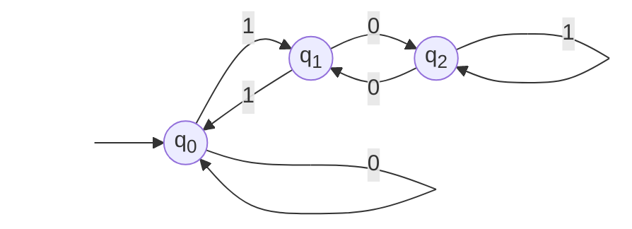
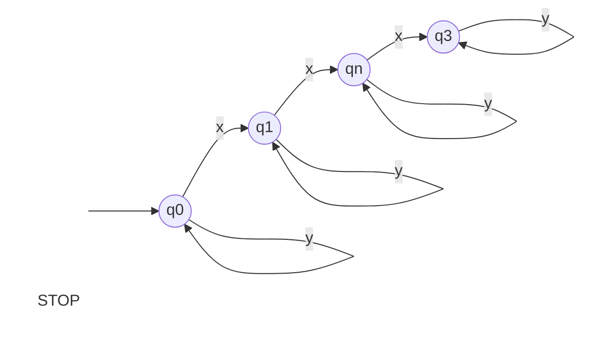

---
puppeteer:
  format: "A4"
  timeout: 3000 # <- Special config, which means waitFor 3000 ms

export_on_save:
    puppeteer: true # export PDF on save
    puppeteer: ["pdf"] # export PDF file on save
---
<style>
    .center {
        display: flex;
        justify-content: center;
    }

    .leftTable {
        display: block;
        margin-left: 0px;
        margin-right: auto;
        width: 40%;
    }

    .leftTable th {
        background: rgba(0,0,0,0.2);
    }

    .centerTable {
        display: block;
        margin-left: auto;
        margin-right: auto;
        width: 40%;
    }

    .centerTable th {
        background: rgba(0,0,0,0.4);
    }

    .highlightFirstColumn tr td:nth-child(1) {
        background: rgba(0,0,0,0.2);
    }
</style>


# Formal Languages — CSE 4083 & CSE 5210

Grant Butler, CSE4083 Spring 2022, Computer Science B.S.

<div style="page-break-after: always; break-after: page;"></div>

## 1 Deterministic Finite Automata

<a id="1">[1.](#tbRet)</a> Consider a DFA $M=(Q, Σ, δ, s, f)$ with States $Q =\{s, q_1, q_2, f\}$ where _s_ is the start and _f_ is the final state; </br>
Alphabet $Σ = \{0,1\}$ and transition function _δ_.

Construct a state transition table for _δ_ (or you can draw a state transition diagram) that recognizes regular expressions that are binary strings and multiples of 3, for example, the strings:

<div class="center">

$0, 11, 110, 1001, 1100, ...$

</div>

would be accepted strings, but

<div class="center">

$1, 10, 100, 101, ...$

</div>

would not be accepted.


><sub>
>\*Hint: Think, if $n = 3k$ is a multiple of 3, then the next multiple of 3 is $3k + 3$. </br>
>This could be accomplished by a transition from the current state to a next state by scanning 3 >ones.
></sub>
<div style="page-break-after: always; break-after: page;"></div>

Given language $L= \{0, 11, 110, 1001, 1100, ... \}$ and alphabet $Σ=\{0, 1\}$, </br>the transition table for transition function _δ_ is:

<div class="centerTable highlightFirstColumn">

|       | 0     | 1     |
|:-:    |:-:    |:-:    |
|$q_0$  |$q_0$  |$q_1$  |
|$q_1$  |$q_2$  |$q_0$  |
|$q_2$  |$q_1$  |$q_2$  |

</div>
There are three states in the DFA. The transition diagram is as follows:

<div class="center">



</div>


[//]: # (style STOP  fill:#FFFFFF00, stroke:#FFFFFF00;
         style START fill:#FFFFFF00, stroke:#FFFFFF00;)

<div style="page-break-after: always; break-after: page;"></div>


## 2 Nondeterministic Finite Automata ##

<a id="2">[2.](#tbRet)</a> Explain how any NFA (with λ (or ∈) transitions) can be converted into a DFA that accepts the same language as that accepted by the NFA. That is, the expressive power of NFAs and DFAs are equivalent.  This is known as the Rabin-Scott Theorem.


The Rabin-Scott Theorem states the list of languages DFAs can identify is the same as those that NFAs can recognize.

Then, we need to prove that they are in fact equal. We can use subsets to our advantage. If we prove that both the NFA and DFA are equivalent subsets of each other, then they are equivalent.
_i.e.:_
<div class="center">

$$
\begin{aligned}
L({DFA}) &\subseteq L({NFA})\\
L({DFA}) &\supseteq L({NFA})\\
\implies L(DFA) &= L(NFA)\\
\end{aligned}
$$

</div>

Let the NFA be defined as $A = (Q, Σ, δ, q_0, f)$ where $f$ is the final state and $q_0$ is the initial state.
Then, we can build the DFA $B =\ A' = (Q', Σ, δ, {q_0}', f')$ by doing the following:

- Replace states $Q$ with the power set of $Q$, where $Q' := P(Q)$.<sup><a id="*ret">[*](#*)</a></sup>
- Set starting state of DFA to ${q_0}'$, where ${q_0}' := \{s_0\} \in Q$.<sup><a id="ret">[](#)</a></sup>
- Then define the all words $σ_0, σ_1,...,σ_n ∈ Σ*$ and
all states $C∈Q'$ with transition function $δ : (Q' \times Σ*) \rightarrow Q'$ by:

<div = class"center">

$$
\begin{aligned}
δ(...δ(δ(q_0, σ_0), &σ_1), ..., σ_n)=C∈Q'\\
&\iff\\
\exists\ q_0\in S, Δ(... Δ(Δ(\{q_0\}, &σ_0), σ_1), ..., σ_n) = s ∈ C \subseteq Q
\end{aligned}
$$

</div>

This says that the DFA is equivalent in the state $C ∈ Q'$ if and only if the word for the NFA gives one of the states $s∈C \subseteq Q$. The final states $f'$ is described by every $C \in Q'$ having at least one final state $c ∈ f$. Thus, the DFA A' accepts the same language and words as the NFA A, so they are equivalent.

<div class="footer">
<sub>

<a id="*">[*](#*ret)</a> Note the power set, $Q'$, has finitely many elements, similar to $Q$.
<a id="">[](#ret)</a> For a string $σ_0, ..., σ_n ∈ Σ* \{ σ_0, σ_1, ..., σ_n\} ∈ Σ*$ the NFA is in a state $q$. ⟹ NFA A's beginning state $q_0 ∈ Q$ with $q = Δ(...(Δ(s_0, σ_0), σ_1), ..., σ_n) ∈ F$.

</sub>
</div>

<div style="page-break-after: always; break-after: page;"></div>

## 3 Regular Expressions in the Programming World
<a id="3">[3.](#tbRet)</a> Consider a programming language that has identifiers that start with a lowercase ASCII letter

<div class="center">

$A=\{a..z\}$

</div>

followed by a string of 1 or more digits

<div class="center">

$D=\{0..9\}$

</div>

or 1 or more lowercase ASCII letters. Show how to write this specification as a regular expression.

The expression:
```regex
[a-z]([0-9]+|[a-z]+)
```
gives the correct language, where `[a-z]` gives any lowercase ASCII character, and then `[0-9]+|[a-z]+` choses between any number of digits OR any number of lowercase ASCII characters to follow.

<div style="page-break-after: always; break-after: page;"></div>

## 4 Closure Properties of Languages

Answer these _True_ (T) or _False_ (F) questions. Give a brief explanation of your answer
><sub>
>(for example, explain how to construct a machine that implements the property.)
></sub>

<a id="4">[4.](#tbRet)</a> Regular languages are closed under intersection.

_**TRUE**_. Two regular languages, $L_1, L_2$, are closed under intersection through this logic:

<div class="center">

$$
\begin{aligned}
(L_1\ \cap\  L_2)&=({L_1}'\ \cup\ L_2')'\\
\implies (L_1'\ \cup\ L_2')' &= (\rm Regular'\ \cup\ \rm Regular')' && \rm ∵\ L_1\ \rm and\ L_2→regular\\
&= (\rm Regular\ \cup\ \rm Regular)'\\
&= (\rm Regular)' && \rm ∵\ union\ of\ two\ regular→regular\\
&=\rm Regular && \rm ∵\ complement\ of\ regular→regular
\end{aligned}
$$

</div>

<a id="5">[5.](#tbRet)</a> Regular languages are closed under Kleene-star.

_**TRUE**_. For a language to be regular, there has to be a repeating definite pattern, so for an existing DFA to accept a Kleene-star ($Σ*$), just start at the final state and repeat the transition of the starting state. The DFA will then accept the Kleene-star of that language.

<div style="page-break-after: always; break-after: page;"></div>

## 5 Decision Properties of Languages

<a id="6">[6.](#tbRet)</a> What does it mean to say that a “yes” or “no” question is _undecidable_?

If there isn't an algorithm that can answer yes/no in finite time, then it is undecidable.
</br></br>
##### _True_ (T) or _False_ (F):
- - -

<a id="7">[7.](#tbRet)</a> It is decidable whether or not the language of a DFA is empty or non-empty. Give an explanation of your answer.

_**TRUE**_:
Language accepted by a finite state machine being empty or non-empty is decidable because the DFA can be minimized and then see it it has a single state with no accepting state.

<a id="8">[8.](#tbRet)</a> It is decidable whether or not the language of a DFA is finite or infinite.

_**TRUE**_:
If there are any loops in a DFA, then it will accept an infinite language, and if there aren't any, it will accept a finite language.

<div style="page-break-after: always; break-after: page;"></div>

<a id="9">[9.](#tbRet)</a> It  is  undecidable  whether  or  not  the  a  string _s_ is  accepted  by  a  DFA.

_**FALSE**_:
If a language L has a number of x's is 2:

<div class="center">



</div>

The string _xxy_ is valid, while the string _xxxy_ is not.
_xxy_ goes to final state $q_n$ so it is accepted, but _xxxy_ does not, so it is rejected.

<a id="10">[10.](#tbRet)</a> It is decidable whether or not two regular languages $L_1$ and $L_2$ are equal. Give an explanation of your answer.

_**TRUE**_:
A DFA for $L_1$ should be able to accept every string for $L_2$, so they would be equal. If the DFA does not accept all strings for $L_2$, then they are not equal.

- - -

<div style="page-break-after: always; break-after: page;"></div>

## 6 Equivalence Relations

<a id="11">[11.](#tbRet)</a> On the set ℕ of natural numbers define an equivalence relation $n\equiv m$ if and only if

<div class="center">

$n\mod3=m\mod3$

</div>

><sub>\*Hint: Recall any natural number n can be written as $n= 3q+r$ n with quotient q and remainder r. </br>
And **$n\mod 3 =\{kr:k∈ℕ\}$** The set of all natural numbers that have a remainder of r when divided by 3.
</sub>

Prove that $\equiv$ is an equivalence relation on the set of natural numbers.


<div style="page-break-after: always; break-after: page;"></div>

## 7 The Pumping Lemma for Regular Languages

<a id="12">[12.](#tbRet)</a> DFAs can't count to an arbitrary natural number! Use the pumping lemma for regular languages to show that language

<div class="center">

$EQ=\{w ∈ {\{a, b\}*} : w = a^i b^i \}$

</div>

is not regular. Here the number of _a's_ in the prefix of _w_ equals the number of _b's_ in the suffix of _w_.


<div style="page-break-after: always; break-after: page;"></div>

## 8 Context Free Languages

<a id="13">[13.](#tbRet)</a> Consider the CFG G defined by the productions:

<div class="center">

$S \rightarrow aS|Sb|a|b$

</div>

Prove by induction that no string in $L(G)$ has $ba$ as a sub-string.

><sub>
Hint: To show this do induction on the length of the strings.
</sub>


<a id="14">[14.](#tbRet)</a> Give simple English language descriptions for the strings generated by the
productions following four grammars $(G = (V, T, P, S) )$:

    1. $G_1 \rightarrow S|aS|a$


    2. $G_2 : S!aSa|aa|a$


    3. $G_3 : S|SaS|a$

<div style="page-break-after: always; break-after: page;"></div>

<div class="leftTable">

<a id="tbRet"></a>

| Question                  | Points | Score  |
| :-----------------------: | :----: | :----: |
| [1](#1)                   |   10   |        |
| [2](#2)                   |   15   |        |
| [3](#3)                   |   10   |        |
| [4](#4)                   |   5    |        |
| [5](#5)                   |   5    |        |
| [6](#6)                   |   5    |        |
| [7](#7)                   |   5    |        |
| [8](#8)                   |   5    |        |
| [9](#9)                   |   5    |        |
| [10](#10)                 |   5    |        |
| [11](#11)                 |   10   |        |
| [12](#12)                 |   10   |        |
| [13](#13)                 |   5    |        |
| [14](#14)                 |   5    |        |
| Total:                    |   100  |        |

</div>
